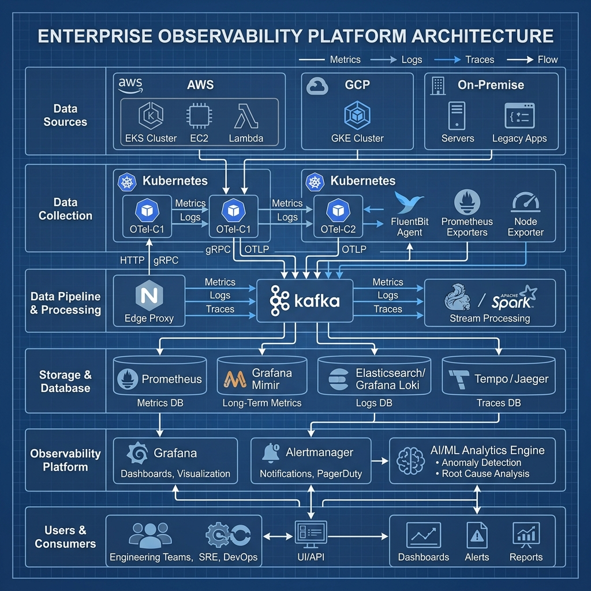
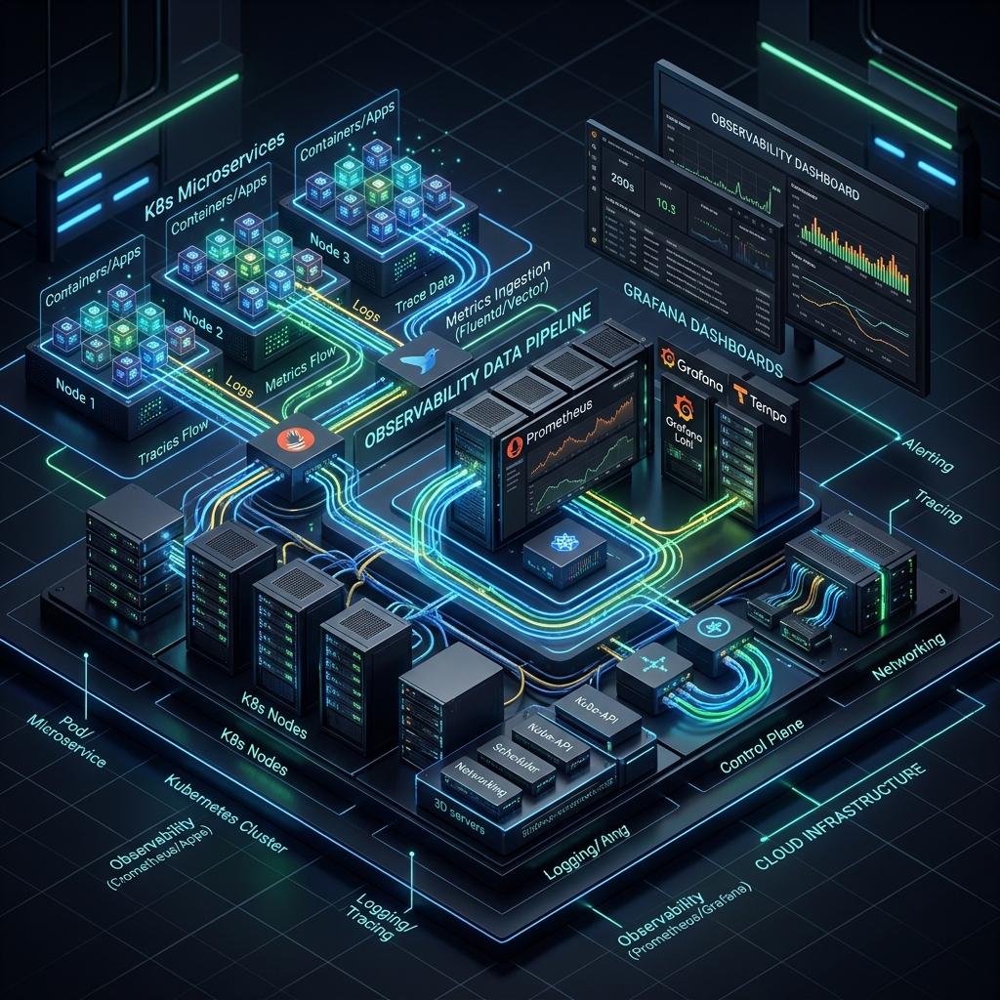
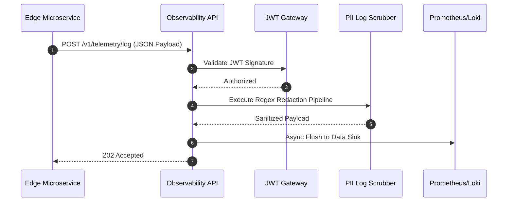

<div align="center">
  
</div>

<h1 align="center">Context Observability</h1>

<p align="center">
  <strong>The Central Intelligence & Telemetry Backbone for Enterprise Context Engineering</strong>
</p>

<p align="center">
  <a href="https://github.com/Devopstrio/context-observability/actions/workflows/ci.yml"></a>
  <a href="https://github.com/Devopstrio/context-observability/actions/workflows/lint.yml"></a>
  <a href="https://github.com/Devopstrio/context-observability/actions/workflows/security-scan.yml"></a>
  <a href="https://python.org"></a>
  <a href="https://fastapi.tiangolo.com/"></a>
  <a href="https://prometheus.io/"></a>
</p>

---

## 📌 Executive Summary

**Context Observability** is the centralized, highly scalable telemetry engine powering the Devopstrio Enterprise ecosystem. It acts as the unified ingestion layer for logs, metrics, and distributed traces across all microservices, providing real-time visibility, automated anomaly detection, and deep forensic auditing capabilities. 

Built on top of **FastAPI** and the **OpenTelemetry (OTLP)** standards, it ensures maximum throughput while enforcing strict security protocols (JWT validation, PII redaction) before data ever reaches long-term storage (Prometheus, Grafana Loki, Tempo).

## 🏗️ System Architecture

Our platform is engineered for cloud-native elasticity and fault tolerance.

<div align="center">
  
  <br/>
  <em>Figure 1: High-Level System Architecture and Data Pipelines</em>
</div>

### Data Flow & Topology (Isometric View)

<div align="center">
  
  <br/>
  <em>Figure 2: 3D Topology of the Kubernetes Deployment and Telemetry Streams</em>
</div>

### Ingestion Sequence

The following sequence diagram illustrates the lifecycle of a telemetry payload being ingested, sanitized, and stored:



## ✨ Core Features

| Feature | Description | Technology Stack |
|---------|-------------|------------------|
| **Unified Ingestion** | Single API gateway for Logs, Metrics, and Traces via REST/OTLP. | FastAPI, Pydantic |
| **Active PII Scrubbing** | Real-time regex inspection pipeline that redacts sensitive tokens (e.g., SSN, Emails) before logging. | Python `re`, Structlog |
| **Distributed Tracing** | Propagates `X-Correlation-ID` to trace complete user journeys across all edge services. | OpenTelemetry SDK |
| **SLA/SLO Alerting** | Evaluates Prometheus gauge streams against predefined anomaly thresholds. | Prometheus Client |
| **Zero-Trust Security** | All ingestion endpoints require cryptographically signed JWT tokens. | PyJWT, Cryptography |

## 🚀 Quick Start (Local Development)

Experience the full observability stack locally using our pre-configured Docker Compose environment.

### 1. Prerequisites
- Python 3.12+
- Docker & Docker Compose
- `make` utility

### 2. Initialization
```bash
# Clone the repository
git clone https://github.com/Devopstrio/context-observability.git
cd context-observability

# Configure virtual environment and dependencies
make install-dev

# Initialize environment variables
cp .env.example .env
```

### 3. Launch the Stack
```bash
# Boot the FastAPI server, Prometheus scraper, and Grafana (if configured)
make docker-up
```
The ingestion API is now available at `http://localhost:8080` and Prometheus metrics at `http://localhost:9090`.

## 📚 Comprehensive Documentation

Explore our exhaustive library of technical guides, ADRs, and runbooks located in the [`/docs`](./docs/README.md) directory.

### 📐 Architecture & Design
- [High-Level Design (HLD)](./docs/architecture/HLD.md)
- [Low-Level Design (LLD)](./docs/architecture/LLD.md)
- [Architecture Decision Records (ADRs)](./docs/architecture/decisions/)
- [Mermaid System Diagrams](./docs/diagrams/)

### 📖 Developer & API Guides
- [API Reference Guide](./docs/api/API_REFERENCE.md)
- [OpenAPI Specification](./docs/api/openapi.yaml)
- [Local Installation Guide](./docs/guides/INSTALLATION.md)

### 🛡️ Security & Operations
- [Threat Model & Compliance](./docs/security/THREAT_MODEL.md)
- [SRE Runbook](./docs/operations/RUNBOOK.md)
- [Kubernetes Deployment Guide](./docs/guides/DEPLOYMENT.md)
- [Prometheus Monitoring Guide](./docs/guides/MONITORING.md)

## 🤝 Contributing

We welcome contributions from the internal Devopstrio team! Please review our [Contributing Guidelines](CONTRIBUTING.md) and [Code of Conduct](CODE_OF_CONDUCT.md) before submitting pull requests.

## 📄 License

This project is licensed under the [MIT License](LICENSE) - Copyright (c) 2026 Devopstrio.

---
<div align="center">
  <p><b>Built with precision by Devopstrio Enterprise Engineering.</b></p>
</div>
